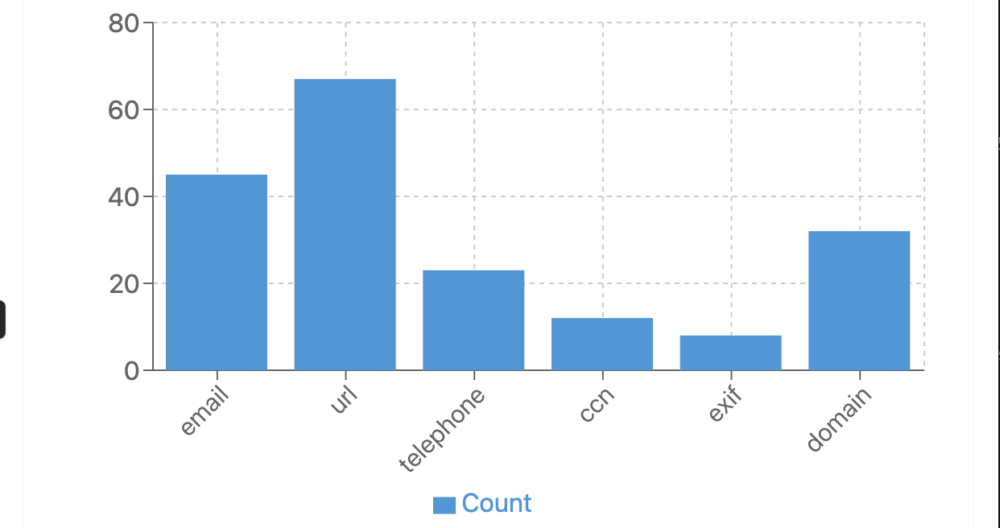

# Detector Gadget


Detector Gadget is an eDiscovery and digital forensics analysis tool that leverages bulk_extractor to identify and extract features from digital evidence. Built with a containerized architecture, it provides a web interface for submitting, processing, and visualizing forensic analysis data.



## Features

- **Digital Forensics Analysis**: Extract emails, credit card numbers, URLs, and more from digital evidence
- **Web-based Interface**: Simple dashboard for job submission and results visualization
- **Data Visualization**: Interactive charts and graphs for analysis results
- **Asynchronous Processing**: Background job processing with Celery
- **Containerized Architecture**: Kali Linux container for bulk_extractor and Python container for the web application
- **Report Generation**: Automated generation and delivery of analysis reports
- **RESTful API**: JSON API endpoints for programmatic access

## Architecture

Detector Gadget consists of several containerized services:

- **Web Application (Flask)**: Handles user authentication, job submission, and results display
- **Background Worker (Celery)**: Processes analysis jobs asynchronously
- **Bulk Extractor (Kali Linux)**: Performs the actual forensic analysis
- **Database (PostgreSQL)**: Stores users, jobs, and extracted features
- **Message Broker (Redis)**: Facilitates communication between web app and workers

## Getting Started

### Prerequisites

- Docker and Docker Compose
- Git

### Installation

1. **Clone the repository**
   ```bash
   git clone https://github.com/yourusername/detector-gadget.git
   cd detector-gadget
   ```

2. **Start the services**
   ```bash
   docker-compose up -d
   ```

3. **Initialize the database**
   ```bash
   curl http://localhost:5000/init_db
   ```

4. **Access the application**
   
   Open your browser and navigate to http://localhost:5000
   
   Default admin credentials:
   - Username: `admin`
   - Password: `admin`

## Usage

### Submitting a Job

1. Log in to the application
2. Navigate to "Submit Job"
3. Upload a file or provide a URL to analyze
4. Specify an output destination (email or S3 URL)
5. Submit the job

### Viewing Results

1. Navigate to "Dashboard" to see all jobs
2. Click on a job to view detailed results
3. Explore the visualizations and extracted features

## Development

### Running Tests

```bash
# Install test dependencies
gem install rspec httparty rack-test

# Run tests against a running application
rake test

# Or run tests in Docker
rake docker_test
```

### Project Structure

```
detector-gadget/
├── Dockerfile.kali             # Kali Linux with bulk_extractor
├── Dockerfile.python           # Python application
├── README.md                   # This file
├── Rakefile                    # Test tasks
├── app.py                      # Main Flask application
├── celery_init.py              # Celery initialization
├── docker-compose.yml          # Service orchestration
├── entrypoint.sh               # Container entrypoint
├── requirements.txt            # Python dependencies
├── spec/                       # RSpec tests
│   ├── app_spec.rb             # API tests
│   ├── fixtures/               # Test fixtures
│   └── spec_helper.rb          # Test configuration
├── templates/                  # HTML templates
│   ├── dashboard.html          # Dashboard view
│   ├── job_details.html        # Job details view
│   ├── login.html              # Login form
│   ├── register.html           # Registration form
│   └── submit_job.html         # Job submission form
└── utils.py                    # Utility functions and tasks
```

## Customization

### Adding New Feature Extractors

Modify the `process_job` function in `utils.py` to add new extraction capabilities:

```python
def process_job(job_id, file_path_or_url):
    # ...existing code...
    
    # Add custom bulk_extractor parameters
    client.containers.run(
        'bulk_extractor_image',
        command=f'-o /output -e email -e url -e ccn -YOUR_NEW_SCANNER /input/file',
        volumes={
            file_path: {'bind': '/input/file', 'mode': 'ro'},
            output_dir: {'bind': '/output', 'mode': 'rw'}
        },
        remove=True
    )
    
    # ...existing code...
```

### Configuring Email Delivery

Set these environment variables in `docker-compose.yml`:

```yaml
environment:
  - SMTP_HOST=smtp.your-provider.com
  - SMTP_PORT=587
  - SMTP_USER=your-username
  - SMTP_PASS=your-password
  - SMTP_FROM=noreply@your-domain.com
```

## Production Deployment

For production environments:

1. **Update secrets**:
   - Generate a strong `SECRET_KEY`
   - Change default database credentials
   - Use environment variables for sensitive information

2. **Configure TLS/SSL**:
   - Set up a reverse proxy (Nginx, Traefik)
   - Configure SSL certificates

3. **Backups**:
   - Set up regular database backups

4. **Monitoring**:
   - Implement monitoring for application health

## Security Considerations

- All user-supplied files are processed in isolated containers
- Passwords are securely hashed with Werkzeug's password hashing
- Protected routes require authentication
- Input validation is performed on all user inputs

## Future Development

- User roles and permissions
- Advanced search capabilities
- PDF report generation
- Timeline visualization
- Case management
- Additional forensic tools

## Troubleshooting

### Common Issues

**Bulk Extractor container fails to start**
```bash
# Check container logs
docker logs detector-gadget_bulk_extractor_1

# Rebuild the container
docker-compose build --no-cache bulk_extractor
```

**Database connection issues**
```bash
# Ensure PostgreSQL is running
docker-compose ps db

# Check connection parameters
docker-compose exec web env | grep DATABASE_URL
```

## License

This project is licensed under the MIT License - see the LICENSE file for details.

## Acknowledgements

- [Bulk Extractor](https://github.com/simsong/bulk_extractor) - Digital forensics tool
- [Flask](https://flask.palletsprojects.com/) - Web framework
- [Celery](https://docs.celeryproject.org/) - Task queue
- [Chart.js](https://www.chartjs.org/) - JavaScript charting library
- [Bootstrap](https://getbootstrap.com/) - CSS framework
